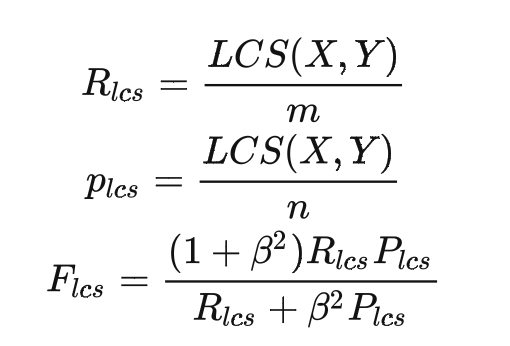

# 导航
- [简介](#简介)
- [数据集介绍](#数据集介绍)
  - [隐私信息抽取数据集](#隐私信息抽取数据集)
  - [法律法规要点检测数据集](#法律法规要点检测数据集)
  - [领域问答数据集](#领域问答数据集)
- [模型介绍](#模型介绍)
- [快速开始](#快速开始)
  - [模型下载](##模型下载)
  - [模型加载](#pretrain模型加载)
- [评价指标](#Metrics)
- [Benchmark](#Benchmark)
- [联系我们](#联系我们)
- [版权许可](#License)

# 简介

ComBERT（Compliance BERT）是专注于数据合规领域的预训练模型，微调后可用于实现隐私信息抽取（NER）、法律法规要点检测（分类）、领域问答（QA）等功能。本项目主要包含了ComBERT-330M（24-layer, 1024-hidden, 16-heads）的预训练模型文件、相关下游任务的评测数据集（基于手动收集的应用市场app的隐私协议构建）及相应评测结果。

# 数据集介绍

本项目设置了三个下游任务（实体抽取，文本分类和阅读理解）对ComBERT进行全面评价，分别对应下列三个数据集：隐私信息抽取数据集、法律法规要点检测数据集和问答数据集（本次开源各部分的评测集，数据集已进行脱敏处理）。
## 隐私信息抽取数据集
该数据集用于检测ComBERT从协议文本中抽取声明的隐私信息的能力，开源的测试集样本约为8800句。标注采用NER任务通用的BIOE的标注体系，标注的内容为文本声明采集的隐私数据类型，标签的索引对应关系为{O:0,B:1,I:3,E:2}, 标注样例如下：

  |                                                                           句子                                                                           |                                                                                                                                                                                标签                                                                                                                                                                                |
  |:------------------------------------------------------------------------------------------------------------------------------------------------------:|:----------------------------------------------------------------------------------------------------------------------------------------------------------------------------------------------------------------------------------------------------------------------------------------------------------------------------------------------------------------:|
  | 当您准备购买我们提供的商品或服务时，或您准备购买由我们的关联公司、合作伙伴/机构提供的商品或服务时，主动向我们提供的相关个人信息，包括**姓名**、**性别**、**身份证件号码**、**密码**、**银行卡号**、**交易账单信息**、**配送地址**、**发票开具信息**、备注信息以及其他信息。 |[0, 0, 0, 0, 0, 0, 0, 0, 0, 0, 0, 0, 0, 0, 0, 0, 0, 0, 0, 0, 0, 0, 0, 0, 0, 0, 0, 0, 0, 0, 0, 0, 0, 0, 0, 0, 0, 0, 0, 0, 0, 0, 0, 0, 0, 0, 0, 0, 0, 0, 0, 0, 0, 0, 0, 0, 0, 0, 0, 0, 0, 0, 0, 0, 0, 0, 0, 1, 2, 0, 1, 2, 0, 1, 3, 3, 3, 3, 2, 0, 1, 2, 0, 1, 3, 3, 2, 0, 1, 3, 3, 3, 3, 2, 0, 1, 3, 3, 2, 0, 1, 3, 3, 3, 3, 2, 0, 0, 0, 0, 0, 0, 0, 0, 0, 0, 0, 0]|

## 法律法规要点检测数据集
该数据集用于检测ComBERT对法律法规规定要点的检测能力，本数据集共包含以下10个法律法规要点，数据规模同隐私信息抽取数据集：
  - 个人信息超期处理方式(ExceedLimit)
  - 个人信息存储地信息(StorageRegion)
  - 个人信息存储时间（StorageTime）
  - 隐私政策时效性信息(Aging)
  - 个人信息查询描述（Query，用户权利保障）
  - 个人信息更正描述 (Correct，用户权利保障)
  - 个人信息删除描述(Delete，用户权利保障)
  - 注销账户时，个人信息处置方式(Logout，用户权利保障)
  - SDK使用信息说明（SDK）
  - 撤销授权方式说明（Repeal，用户权利保障）

对每个句子进行0/1标注，标注形式样例如下：

  |                                                                           句子                                                                           |               标签               |
  |:------------------------------------------------------------------------------------------------------------------------------------------------------:|:------------------------------:|
  | 在以下情形中，您可以向我们提出删除个人信息的请求 |     [0,0,0,0,0,0,1,0,0,0]      |

**注意：本数据集的标签是基于2019年颁布的[app违法违规收集使用个人信息自评估指南](App.pdf)进行解析标注的，标签会在后续项目维护中更新。**

## 领域问答数据集

该数据集用于衡量ComBERT的阅读理解能力，与抽取式机器阅读理解 (MRC) 的数据形式一致，给定一段协议文本和一个查询（query）的组合，模型需要从协议文本中找出合适的答案。这个数据集包含约2300条协议文本，以及对应的查询。该数据集的特点是答案只在协议文本中出现一次，且只占据一个连续的文本片段。样例如下：

  |                   context                    |        query         |   answer   |
  | :------------------------------------------: | :------------------: | :--------: |
  | 获取麦克风权限，此权限用于跟读评测学习内容； | 请问采集了哪些信息？ | 麦克风权限 |

# 模型介绍

## 预训练模型

ComBERT是在[chinese-roberta-wwm-ext-large](https://huggingface.co/hfl/chinese-roberta-wwm-ext-large)模型的基础上，利用数万篇相关领域内语料进行further pretrain，预训练过程中仅使用Masked Language Model（MLM）任务，并使用whole word masking（wwm）的形式。
模型结构： 24-layer, 1024-hidden, 16-heads, 330M parameters


# 快速开始
## 模型下载
本项目提供的模型为pytorch版本。


|  模型   | 模型类型 |                           下载地址                           |
| :-----: | :------: | :----------------------------------------------------------: |
| ComBERT | pretrain | [pytorch](oss://antsys-dsg-compliance-risk/compliance-ai/models/pretrain/checkpoint-100000/) |


## pretrain模型加载
本次开源的pretrain模型(ComBERT)可以通过huggingface的transformers快速加载（需提前下载模型文件到本地路径），具体方式类似bert-base。
``` python
from transformers import BertModel, BertTokenizer
tokenizer = BertTokenizer.from_pretrained("model_dir")
model = BertModel.from_pretrained("model_dir")
```

# Metrics

## 隐私信息抽取：
- BIOE Macro-averaging metrics： BIOE标注，分别计算B、I、O、E标签的precision、recall、f1-score，再取均值，即Macro-averaging precision、recall、f1-score。

## 完备性检测：
- precision: 对于每一类标签计算precision再取均值
- recall: 对于每一类标签计算recall再取均值
- f1_score: 对于每一类标签计算f1-score再取均值

## 领域问答:

- rouge-L (F1): 测量预测答案与真实答案之间的词级模糊匹配，不把预测答案和真实答案当作”一袋词“，而是计算它们之间最长公共序列（LCS）的长度，并相应地计算precision(P), recall(R)和F1-score(F1)。\
  
- Exact Match (EM): 完全一致匹配，完全一致记1分，否则记0分
- re-85: 模糊匹配（利用fuzzywuzzy.partial_ratio计算）分数高于85，则视为预测正确

# Benchmark
## 隐私信息抽取

下面将bert_base模型、roberta-wwm-ext-large模型和ComBERT在ner任务上finetune的效果进行实验，指标为precision(P), recall(R), F1-score(F1)（单位：%），实验结果如下表。

|           模型      | P | R |F1 |
|:-----------------------:|:---------:|:------:|:----------:|
|       bert-base   |   92.43   | 79.09  | 85.00  |
|  roberta-wwm-ext-large  |   90.00   | 87.06  |  88.41 |
|        ComBERT        |   **90.75**   | **92.87** | **91.79** |


## 法律法规要点检测 
下表是三种模型在完备性检测任务的效果，指标为各类的precision(P), recall(R), F1-score(F1)的均值（单位：%）。

|           模型         | P | R |F1 |
|:----------------------:|:---------:|:------:|:-------------:|
|       bert-base        |   87.82   | 94.26  |  90.68  |
| roberta-wwm-ext-large    |   92.38   | 92.53  |  91.83   |
| ComBERT |   **94.17**   | **94.06** |  **93.99**|

## 阅读理解
以下为ComBERT与其他已开源阅读理解模型在本领域问答数据集的评测结果对比，指标为最长公共序列的precision(P)，recall(R)和F1-score(F1)、EM和re-85（单位：%）

|               | P     | R     | F1    | EM    | re_85 |
|:-------------:|:-----:|:-----:|:-----:|:-----:|:-----:|
| [alicemind 中文简体问答模型](https://alicemind.aliyuncs.com/#/combination/modelSquare) |   5.13    |   5.44    |   4.98    |   1.64    |   7.40    |
| [SiameseUIE](https://modelscope.cn/models/damo/nlp_structbert_siamese-uie_chinese-base/summary) |   17.62   |   17.82   |   15.88   |   9.86    |   26.08   |
| [erlangshen](https://huggingface.co/IDEA-CCNL/Erlangshen-UniEX-RoBERTa-330M-Chinese) |   57.53   |   47.97   |   47.99   |   31.01   |   76.43   |
|                           ComBERT                            | **81.82** | **60.92** | **67.46** | **54.89** | **96.89** |

# License

本项目中开源的模型遵循[Apache-2.0 License](MODEL_LICENSE), 数据集遵循[cc-by-nc-sa-4.0 License](DATA_LICENSE)。 

# 联系我们

对于使用ComBERT的帮助或问题，请提交GitHub Issues。
